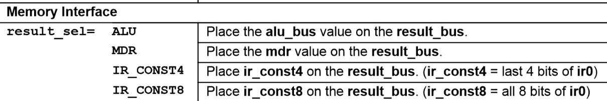

# Comp262 Lab: Control Unit
{: .no_toc}

How does a CPU actually "understand" computer code? Logic circuits, of course! In this week's lab, you will explore the role of the Control Unit in the CPU.

By the end of the lab, we hope you will have formed simple and accurate conceptual models for two types of Control Unit -- microprogrammed and hardwired -- and have *dispelled* any residual feeling that there must be magic dust inside.

Learning objectives:

* Understand how a computer "knows" how to "read" your computer code
- Appreciate the importance of the CPU **fetch, decode, execute cycle** that occurs over and over, trillions of times, from the moment the computer boots up until i is shutdown
* Gain a deeper understanding of the CPU Control Unit by implementing your own simple versions of both hardwired and microcoded Control Units

You'll need to read through the next several sections before you begin any coding today!

## Background Readings

1. [Wikipedia Article on the Fetch-Decode-Execute Cycle](https://en.wikipedia.org/wiki/Instruction_cycle) 
2. Book by John Scott. "But How Do it Know?" (Extract available on Canvas; Full book available at Broome Library)

## Table of Contents
{: .no_toc .text-delta }

{:toc}

## Introduction: Purpose of a Control Unit

We have talked about how the CPU consists of components including an ALU, registers, an interface to the system bus, and a Control Unit. The Control Unit (CU) is basically capable of two things:

1. Interpreting sequences of zeros and ones (interpreting/decoding instructions)

2. Activating/deactiving other components of the CPU via their control pins (executing instructions)

The CU is either implemented *directly* using clever logic circuits (hardwired) or is implemented *indirectly* by using a micro-controller (of sorts) that sits within the CU and is dedicated to exactly to doing the task of the CU. In the second case, the micro-controllers (if you wish to call them that) that run the CU's microprograms require their own micro-interpretation and micro-execution of their micro-instructions, so if you peel off another layer you end up with the same types of logic circuits that you've been dealing with in class so far -- flip flops, multiplexers, and adders. (Note: Later in the lab, see the top half of the reference diagram in the Quick Reference Card for MythSim.) The reason you'd want to implement a CU this second way is that it means the CU can be re-microprogrammed, allowing for more versatility.

Today, you will work with an 8-bit computer architecture: that is, 8-bit CPU with an 8-bit ALU, RAM organized into 8-bit groupings, etc. Your task over the next few parts of this lab will be to explore and implement a Control Unit for very simple a set of instructions.

## A Simple Architecture

As I mentioned, the instruction set I've been inventing will be brought to life by the internal circuitry of the Control Unit. The architecture I'm defining today is very simple. In fact, its implementation requires just a few components:

- 2 kB of RAM, organized as 256 x 8b (256 distinct groups of 8 bits each)

- An 8-bit register (which I've been calling the *CPU's primary register*)

- A 16-bit register (the instruction register), or two 8-bit registers for this

- An 8-bit ALU

- A Control Unit

- Buses and individual control lines connecting these components

In the next section, I will invent an instruction set that uses these components. 

### A Simple Program

Zeros and ones don't hold any inherent meaning. We choose to give them meaning. If I want, I can decide that 0000 means "Hello!", 0100 means "Screw you!". Alternatively, I can decide 0000 means "LOAD" and 0100 means "Cheeseburger." It truly does not matter to the universe.

Before you build a CU, you need to decide which sequences of zeros and ones should mean what instructions to the people who are going to be writing the programs (and assemblers) targeting your architecture. If you are building your own CU, you get to decide what the binary codes mean for yourself. For today, let's all agree that the following two-bit binary codes represent the following four CPU operations:

    00 means "LOAD"

    01 means "ADD"

    10 means "STORE"

    11 means "STOP"

Got it? Great!

Now, think back to the previous lab(s) you did on Memory Addressing and the Hierarchy of Memory. When you load in a word from RAM, you always need to specify a memory address in RAM from which to retrieve that word, right? Today, our RAM is addressable via eight address pins. So, we need to specify 8-bits for the memory address.

    0000 0000 means "RAM Address #0"

    ....

    1111 1111 means "RAM Address #255".

At each address, since we're rolling with an 8-bit architecture, we are going to store one byte (8 bits) of data. So, we have eight data pins as well!

The bytes of data we store in RAM can represent anything, including instructions. If we want to represent each of our four previously-discussed operations as a byte, we can just add six unused bits in addition to our two used bits:

    00 00 00 00 means "LOAD"

    00 00 01 00 means "ADD"

    00 00 10 00 means "STORE"

    00 00 11 00 means "STOP"

(If you think it's odd that I chose to put the two important bits where I did, you'll see why in Part 3 -- it's because of the specific microarchitecture of MythSim's Control Unit.)

Let's say today's **LOAD** operation means: *Load one byte of data from RAM into the CPU's primary register*. A complete "LOAD" instruction (16-bits) will have include a memory address from which to load the data. We should probably specify that address somewhere in our 16-bit instruction, then! Let's use the the second instruction byte to specify the operation ("LOAD") and the first instruction byte to specify the RAM address These are the the *two consecutive bytes* in RAM that specify a complete LOAD instruction:

    0000 0011      RAM Address #3

    00 00 00 00    LOAD

All combined, we will call these sixteen bits our "instruction." The above represents an instruction to the CPU to load in the byte of data located at RAM address #3. This instruction will be stored in RAM (at other addresses besides #3, presumably). At the beginning of the CPU's fetch-decode-execute cycle, we will load both bytes of the instruction into the single 16-bit instruction register. Next, we will decode the instruction. Finally, we will execute the instruction.

You may wonder, why did we use the *second* instruction byte for the operation code? This choice may seem odd right now, but it was made with foresight to the specific microarchitecture of the micropogrammed Control Unit you will work with in Part 3. For that specific microarchitecture, the opcode must be specified in the first six bits of the second instruction byte.

Let's say today's **STOP** operation means: *Halt execution of the program.* Our sixteen-bit instruction will be:

    0000 0000     (unused byte)
    00 00 11 00   STOP

Note that in this architecture that we're designing, all of our instructions are 16-bit. So, you *always* need to specify both bytes for even this simple instruction. Note that, contrary to what you might think, there is no way to accidentally misinterpret the first byte of an instruction to be something it is not, since the "fetch" step will grab *both* bytes and look only at the second byte to decide on the operation to execute in that cycle. If the operation specified in that second byte is 'STOP', the CU never even "looks" at the first instruction byte that it fetched.

Now that I have two 16-bit instructions (LOAD and STOP) ready to go, let's string together some instructions and write a little program in our RAM:

| RAM Address | Byte Stored | Meaning of Byte  |
|:-----------:|:-----------:|:----------------:|
| #0          | 0100 0000   | RAM Address #64  |
| #1          | 00 00 00 00 | LOAD             |
| #2          | 0010 0001   | RAM Address #33  |
| #3          | 00 00 00 00 | LOAD             |
| #4          | 1100 0100   | RAM Address #196 |
| #5          | 00 00 00 00 | LOAD             |
| #6          | 0000 0000   | (unused byte)    |
| #7          | 00 00 11 00 | STOP             |
| ...         |             |                  |
| #33         | 0101 0101   | 85               |
| ...         |             |                  |
| #64         | 0000 0011   | 3                |
| ....        |             |                  |
| #196        | 1100 1010   | 202              |
| ...         |             |                  |
| #255        | 0000 0000   | *no meaning*     |

The pseudocode for the program represented in RAM above is as follows:

1. Load the byte from RAM Address #64 (in this case, "3") into the CPU's primary register.

2. Load the byte from RAM Address #33 ("85") into the CPU's primary register (overwriting the number "3.")

3. Load the byte from RAM Address #196 ("202") into the CPU's primary register (overwriting the number "85.")

4. Halt.

*Note*: The first eight bytes of RAM above (RAM addresses #0 - #7) represent four consecutive instructions of two bytes each. Taken together, they form a program written in "machine code." Machine code is the lowest level of programming. It is a program consisting of sequences of zeros and ones, specifically arranged so as to be understood by the target computer's control unit (unique to the architecture). Assembly language is "assembled" into machine code.

*Note:*  I've been using spaces between my zeros occasionally, these don't mean anything in RAM -- they're just to make it easier for you to read. E.g. "00 00" and "0000" and "0 000" are all the same.

### Finishing the Instruction Set

Let's round off the instruction set that I started defining in the last section. I already invented a definition for the LOAD and STOP operations, and wrote those definitions out in the previous section. Now I'll define the other two operations, STORE and ADD. Remember that since I'm building the control unit, I can have whatever binary codes do whatever operations I want, and make my operations mean anything I want. So, read these definitions that I've chosen carefully before writing any program for my architecture!

The **STORE** operation will be like LOAD, but instead of loading the byte *from* the specified RAM into the CPU's primary register, it will load from the CPU's primary register *into* the specified RAM address. Example of a complete STORE instruction:

    0000 0010      RAM Address #3
    00 00 10 00    STORE

The **ADD** operation will be kind of funny, so pay attention! ADD will add together two numbers: The first number (1) will be the number specified by the second byte of the instruction. The second number (2) will be the number *already present* in the CPU's primary register. The result of the addition of (1) and (2) will be stored in the CPU's primary register, overwriting the number that was already there. Here's an example of a complete ADD instruction:

    0001 0010     18
    00 00 01 00   ADD

If, prior to this instruction being executed, the CPU's primary register contained "0001 0011" (19), then *after* this instruction was executed the CPU's primary register would contain "1001 0100" (37, since 18 + 19 = 37). 

## Part 1: Write Your Own Program

#### Assignment Description

In this part of the lab, you will write a program a bit more advanced than what you saw in the earlier section, but with the same instruction set. You'll save it into a text file that represents your RAM for a CPU simulator. Then, you'll run the CPU simulator and make sure your program works as expected!

Here's the specification for the program I'd like you to implement: **Adds 27 + 10 + 3 + 56 + 18, then saves the 8-bit result of this addition into RAM address #255.**

Note: Do not assume to know anything about what's already in the CPU's Primary Register before your program starts.

#### Syntax for RAM text file ("MyRAM.mem")

You are going to create your own RAM text file. Instead of the file extension ".txt", I want you to give it the file extension ".mem". There is a specific formatting that the file must have in order to be successfully run through the CPU simulator. Please download and examine the example of the code from the "A Simple Program" section that has written in this syntax (posted on Canvas). Note that while a real memory chip does *not* allow for each byte to be commented :-) , for this lab you must comment each byte of memory (follow the lead of the example).

#### Running Your Program

Your instructors wrote the first CPU simulator, in Python. It reads in your RAM file and simulates a computer running your program, with the architecture described above.

To run your program, copy your RAM text file into the same directory as the CPUSim.py and then, from the Terminal, call:

```bash
python CPUSim.py MyRAM.mem
```

Once your program runs correctly, save a screenshot of your output.

#### Submission

You'll make a single .zip file which will contain your submission for all Parts of this lab. Here's what you'll need to include from Part 1:

* "MyRAM.mem" -- your RAM text file (commented exactly as the provided example was commented)

* "Part 1.PNG" -- a screenshot of the output from running your program

File requirements for "MyRAM.mem":

- For this lab, you must specify the byte using *only zeros and ones* (as shown in sample262.mem). (Even though MythSim's .mem file format supports decimal entries, do not write in decimal for today's lab.)
- Add a *"//" line between each program instruction*, for ease of reading (as shown in sample262.mem)
- For each byte, write the *meaning of the binary code as a comment after it* (as shown in sample262.mem)

## Part 2: Build Your Own Hardwired CU

#### Assignment Description

In this Part, I am asking you to use CircuitVerse to implement a hardwired Control Unit. To make it easier while retaining the learning outcome, I'll have you build a hardwired control unit for a modified version of the architecture I described in Part 1. This modified version will only have the LOAD and STOP operations. Also, instead of RAM with 256 x 8b, you will use ROM with 16 x 8b. Everything else will be the same as described in Part 1.

Once you've built your hardwired CU, I want you to run the sample program below (which is a *program*, **not** a microprogram) on the CPU and confirm that it is working as expected. Use the ROM element instead of the RAM element -- and manually type in the bytes of this program. (Since CircuitVerse doesn't let you initialize RAM with the values you'd like, we're using the ROM element as a stand-in for CPU RAM.) Your sample program is as follows:

| ROM Addr. | Byte Stored | Hex | Meaning of Byte |
|:---------:|:-----------:|:---:|:---------------:|
| #0        | 0000 1011   | 0B  | ROM Address #11 |
| #1        | 00 00 00 00 | 00  | LOAD            |
| #2        | 0000 1110   | 0E  | ROM Address #14 |
| #3        | 00 00 00 00 | 00  | LOAD            |
| #4        | 0000 1111   | 0F  | ROM Address #15 |
| #5        | 00 00 00 00 | 00  | LOAD            |
| #6        | 0000 0000   | 00  | (unused byte)   |
| #7        | 00 00 11 00 | C0  | STOP            |
| ...       |             |     |                 |
| #11       | 0101 0101   | 55  | 85              |
| ...       |             |     |                 |
| #14       | 1100 1010   | CA  | 202             |
| #15       | 0000 0011   | 03  | 3               |

#### Submission

The contribution from Part 2 to your .zip file is as follows:

* "Part 2.PNG" -- a screenshot showing your full circuit in the state after it has loaded its final instruction.

Also, submit your work on CircuitVerse just like you have on past labs: under the proper assignment title, and before the due date for this lab listed on Canvas.

Your CircuitVerse submission needs to include the following elements essential to implementing this architecture:

* ROM (we are using this as a stand-in for our CPU's RAM, since in CircuitVerse you can't type your own values into RAM)
* 8-bit register labeled "CPU's Primary Register"
* Two 8-bit registers labeled "Instruction Register 0" and "Instruction Register 1" (to hold the two bytes of your instruction)
* 8-bit register labeled "Instruction Address Register"
* 8-bit register labeled "Memory Address Register"

Your submission must also meet the following criteria:

* When I load the webpage of your circuit, your program should start running immediately. Your *whole program* should run to completion in under 10 seconds. Develop your circuit with a fairly slow clock speed parameter, but then speed up the clock parameter significantly prior to submission.
* At the end of your program, no new instructions should be fetched. That is, STOP should be implemented in a way that makes sense.

#### Help!

This assignment is meant to be challenging, and to give you a chance to put into practice what you've learned about logic circuits this semester. If you find it difficult to decide how to start, that's a feature -- many goals you will tackle in your career will feel this way. That is, you will have a goal in mind, many of the skills you need to succeed, and knowledge of various resources that can help -- but not explicit instructions that tell you in a step-by-step fashion what to do.

If you need to take a break from this Part, I'd encourage you to do so and come back to this problem after you've succeed in the other Parts -- you may gain fresh perspective after getting more "hands-on" practice with the MythSim microprogrammed Control Unit of Part 3.

If you're still having trouble, or even if you're not having trouble, I'd recommend reading the 28-page introduction to the inner workings of a hardwired Control Unit from John Scott's "But How Do It Know?" This PDF will be posted on Canvas.

As you work to complete this lab, I encourage you to take advantage of our CS tutoring center, which is open every day and located just across the hall from our classroom.

#### Tips

* The logic circuits in the CU implement our instruction set, and can run *any* program written with that instruction set. The CU is built to do "fetch, decode, execute" over and over again. Your *program* is contained in the RAM (ROM, in this case) -- **not** in logic circuits of the CU. If you're trying to build anything specific to your *program* today using logic gates, you are doing it wrong!

* The logical flow of the steps that fetch will be the same for every instruction. The logical steps of the decode will also be the same. The logical steps that execute will depend on what you decode, so will be different for each instruction.
- Your hardwired control unit should definitely leverage what you learned about steppers in the Sequential Logic Circuits lab.
* I recommend starting by getting step 1 working right, then step 2, then step 3.... rather than trying to tackle the whole thing at once!

* You'll need to use CircuitVerse functions like "Splitter" or "Select Bit" at certain points to break apart your bytes.

## Introduction to Part 3: Microprogramming

In this part of the lab, you will implement the fetch-decode-execute cycle for this architecture by making your own microprogrammed CU. You will implement this CU within a *CPU* that has many more internal registers and components than are needed for this architecture. In other words, this CPU has the hardware capability for a much more complicated instruction set. Nonetheless, it is your job today as the microprogrammer to implement only the instruction set I've described. One might imagine that later we could update the microcode for this CPU and add more instructions!

### Introduction to MythSim

#### Overview of the MythSim Simulator

The CPU simulator you'll be using for this section is called MythSim. MythSim lets you practice microprogramming of a CU. Once you get the hang of it, MythSim allows you to deeply understand how the CU interplays with the CPU.

Essential documents to download, that you will find on the [GitHub page for MythSim](https://github.com/jasonv/MythSim) (scroll to the documentation) include:

* The Quick Reference Card

* User's Guide

**Read the User's Guide in full now, before moving on -- it is a short read.** Also, I recommend **keeping handy a paper copy of the Quick Reference Card**.

Your instructor will also give the class an overview of this simulator. Don't be too intimidated! If you have questions, first look for your answer in the Quick Reference Card and the User's Guide. If you can't find the answer, ask us for help.

#### Installing MythSim

Download the .jar file for MythSim from our Canvas page.

Follow instructions from the User's Guide to get up and running in a "Hello, World!" manner, then move onto the next section.

### Microprogrammed CUs

#### Program vs. Microprogram

Your RAM text file (".mem") contains your machine-code program, as well as any non-program data that you wish to store in RAM. This is the same type of file that you made for Part 1. In fact, you will use that exact file.

Your Microcode text file (".ucode" - the greek letter mu, for micro, is replaced with a "u") contains your microprogram. A microprogram is a very different beast from a program. The point of the CU (and hence, the point of microcode) is to implement the instruction set. There is no other purpose.

**The CU enables you to execute machine code stored in RAM. The entire purpose of this microprogram is to fetch, decode, and execute a single instruction of any type -- nothing more, nothing less.** You wouldn't see something written in microcode that adds 10 + 25 + 30 + 15, and then stores it to RAM; that's many fetches, decodes, and executes, and that's what regular programs are for!

Here's the pseudomicrocode for every microprogram, ever! (Ok, I'm exaggerating a little):

    *In an infinite loop,*

1. Fetch next instruction from RAM (bring it into the CPU)

2. Decode the instruction

3. Execute the instruction

Unsurprisingly, the microprogram you write today will also follow this pseudocode. If you find that your microprogram is deviating from the pseudomicrocode, STOP!

#### MicroOrganization & MicroArchitecture

You may be wondering how a microprogram is run, physically. Compared with the CPU it sits inside, the micro-controller that runs your microprogram is very, very simple. The microarchitecture found in MythSim requires only a small chip of ROM, three multiplexers, and an adder.There's a nice graphic in the Quick Reference Card that shows the microarchitecture:


The ROM stores all of the control pin values (T/F) for all possible microinstructions. A microinstruction is one line of microcode in MythSim, and represents one configuration of control pins. So, in the example of the next section, fetch0 is a microinstruction.

In class, we discussed how memory chips can be organized given a group size and number of groups. For our ROM, the group size is based on the number of control pins, and the number of groups is based on the number of possible microinstructions. So, if 20 control pins in the CPU are accessible via microcode, this would result in a group size of a bit more than 20 (we need just a bit of storage for meta-micro-stuff). The memory organization of this ROM would be such that it can output all 20 control values, or one group from ROM, at a time. Each microstep would be represented by a different address in ROM. To move through the microsteps, we simply use logic gates to iterate us through the ROM's address pin values. There is a bit more logic involved as well, for decoding the opcodes, but it's basically just using a multiplexer to jump to a certain address in ROM. Study it in detail above, and make sure you understand what's happening at the microarchitectural level of a microprogrammed CU.

### Short Walkthrough of MicroProgramming in MythSim

#### First steps with microcode: fetch

Look at the example "fetchonly.ucode" file from Canvas. This will be a starting point for your microprogram. The file runs from top to bottom, once for every fetch-decode-execute cycle.

The microcode written in "fetchonly.ucode" only fetches the instruction (Step 1 from our pseudomicrocode.) The decode and execute steps are missing and it will be your job to add them.

No matter which operation we wish to implement, we need to start by fetching our instruction. Look closely at the microcode for fetch, and make sure you understand it properly. I'd recommend starting with a good understanding of this microcode, and then supplementing that by looking at some examples on the GitHub page (especially looking at their decoding/execuiting steps).

```
\\ FETCH This first section of microcode is responsible for fetching one 16-bit instruction (bringing it into the CPU instruction registers.)
\\ Our instruction takes up two bytes, but the architecture is 8-bit. Our solution is to make two consecutive calls to RAM -- one for each byte.
\\ The first byte of instruction is loaded into ir1. The second byte of instruction is loaded into ir0. This ir1-ir0 ordering is deliberately flipped from some of the examples on MythSim's GitHub page, as it is more convenient for our architecture!
\\ For our architecture, our two-bit operation will be therefore contained in the seventh and eighth bit of ir1.

fetch0: a_sel=7, b_sel=7, alu_sel=AND, r6_write, mar_sel=LOAD;
fetch1: r7_write, a_sel=6, alu_sel=ADDA, c_in, read, ir1_sel=LOAD,
        if wait then goto fetch1 endif;
fetch2: a_sel=7, b_sel=7, alu_sel=AND, r6_write, mar_sel=LOAD;
fetch3: r7_write, a_sel=6, alu_sel=ADDA, c_in, read, ir0_sel=LOAD,
        if wait then goto fetch3 endif;

\\ At this point in the microcode, our 16-bit instruction has been fetched into our dual 8-bit instruction registers (ir1 & ir0), and is ready to be decoded!
```

##### Guided interpretation of the above MythSim microcode:

Syntax to notice:

* Comments are marked with "\\\" and are ignored. (see the "Notes" section at the end of the User's Guide for more syntax rules!)

* The beginning of each line is labeled (e.g. "fetch0: ", "fetch1: ", ...), but this is also just for organization. The line labels can be used with "goto" statements.

Good to know:

* Register 7 has a dedicated purpose in this CPU -- it is the instruction address register! That means it is the address in memory from which we will get our next byte of instruction. 

Summary of this microcode:

* Taken together, fetch0 & fetch1 load the first byte of the instruction, and fetch2 & fetch3 load the second byte of the instruction.

Let me walk you through the first line of code, labeled "**fetch0:** ". This should be representative enough to get you a sense of how the microcode works in excruciating, explicit detail with its only capabilities being that of changing values on control lines in order to get its job done.

Before I begin to explain fetch0, I want to point out that microprogramming is very limited. This is on purpose, related to the difference between architecture and microarchitecture, which I discussed a little bit in the an section. For any given line of microcode (each line represents a microinstruction), all you basically can do is set boolean or small-integer variables. Within any given microinstruction, all of your settings occur at once, simultaneously (again, refer to the microarchitecture section); so there is no particular need to order which variables you set within any given line. With that context, here's what happens in the first microinstruction, labeled fetch0:

* The controls a_sel and b_sel are both set to 7.
  
  * Looking at the Quick Reference Card, this means that the byte in Register 7 is placed on *both* the a_bus and b_bus (inputs of the ALU).

* Control alu_sel is set to AND.
  
  * This means that the ALU will do AND operations on its inputs. The byte from Register 7, which was passed onto both buses that input to the ALU, is AND-ed with itself, which means it passes through the ALU unchanged.
  
  * Looking at the diagram on the Quick Reference Card, and given the settings of this microinstruction, the value stored in Register 7 will also be on the ALU bus during this microinstruction. Again referencing this diagram, the ALU bus connects as one of four inputs of a multiplexer controlled by the "result_sel" line.
  
  * The variable "result_sel" wasn't specified here, so its value is 0. (For any given microinstruction, if you don't specify some of the variables, MythSim assumes you want the default value 0.) Looking at the "Memory Interface" section of the Quick Reference Card, it looks like the 0th item for the "result_sel"  control is "ALU", which is what we want and explains why we didn't need to specify result_sel.
  
  
  
  * Looking again on the Quick Reference Card diagram, then, and tracing the data flow given our control settings, the output of the ALU will also be on the result_bus during this microinstruction!
  
  * One more sidenote on interpreting the Quick Reference Card diagram: See how in the screenshot above, alu_sel is represented by an empty dot with an arrow going into the ALU? That means it is a value *coming from* (empty) the *microcode* (dot) and into a *control* (arrow going in) for the ALU.
  
  

* Control r6_write is enabled (set to 1).
  
  * According the Quick Reference Card, this control pin enables whatever is on the result_bus will be written into Register 6.
  * Since the output of the ALU is on the result_bus in this microinstruction, this means that the output of the ALU is also written to Register 6 at the end of this microinstruction's clock tick. We are essentially just copying our instruction from Register 7 to Register 6.

* Control mar_sel is set to LOAD.
  
  * Quick Reference Card says that this will put the value of ALU bus onto the Memory Address Register.
  * The Instruction Address, stored in Register 7 (and soon also to-be in Register 6), is on the ALU bus during this microinstruction.
  * So, that data will be written into the Memory Address Register at the end of this microinstruction's clock tick.
  * That makes sense, since we will want to get the byte of data from RAM that contains our instruction, and to do so, we will need to send our instruction's address to RAM via the intermediary of the Memory Address Register.

In summary, here's a functional view of what the "fetch0" line of microcode did:  

* fetch0 : Copy the the current instruction address byte (from Register 7, the Instruction Address Register) both into the Memory Address Register (mar) and into Register 6.

I won't go into that level of detail describing the next three lines of microcode (the next three microinstructions), but it may help you to work through them yourself. I'll give you a functional view of those next three microinstructions:

* fetch1 : Both (a) increment the value in Register 7 (Instruction Address Register) and (b) load the first instruction byte from RAM into Instruction Register 0.
  * The reason for (a) is to get prepared to read the next instruction byte from RAM.
  * The reason for (b) is to load the first instruction byte into the CPU.
  * Since we have two bytes to fetch for every 16-bit instruction, we are halfway done with our "fetch" task after this microinstruction.
  * Note on:`if wait then goto fetch1 endif` - Looking at the Quick Reference Card, "wait" is a status line from RAM. That means that the CU doesn't control 'wait', but just gets to see its value. If wait is 1, that means that RAM is actively working on a request. If wait is 0, that means the RAM isn't busy. So, this phrase in the microcode basically just says that if RAM isn't ready when the microinstruction is microexecuted, repeat this microinstruction / stay in this control line state / don't move on until you've loaded the byte from RAM! Tying into our Hierarchy of Memory discussion, the registers don't have such pesky 'wait' status lines because of the very high read/write/access times relative to RAM, resulting in the read/write always taking less time than one clock tick.
* fetch2 & fetch3 : Same as fetch0 & fetch1, except loads the second instruction byte into Instruction Register 1.

## Part 3: Microprogram Your Own Control Unit

### Assignment Description

Having read and understood everything in the previous sections, *Introduction to Part 3* , and leveraging the MythSim documentation and examples, finish the microcode in a file called "MyCU.ucode" so that it implements the fetch-decode-execute cycle for our instruction set on this CU. Use MythSim's Memory Data Register (mdr) as the *CPU's Primary Register.* Test your microcode with your "MyRAM.mem" program.

### Submission

You'll make a single .zip file which will contain your submission for all Parts of this lab. Here's what you'll need to include from Part 3:

* "MyCU.ucode" - Your completed microcode
* "Part 3.PNG" A screenshot showing from MythSim proving that your CPU CU microcode is working correctly to implement our architecture -- that is, it gives the right answer when running the program contained in "MyRAM.mem" . Make sure the screenshot includes RAM address #255, at the end of your run, showing the right answer in it.

### Tips

* Any time you need to pass data *through* the Registers block, it will require multiple clock ticks (so multiple microinstructions). E.g. if I want to pass a value  from the mdr to the ALU, I can't do that in a single microinstruction, because there is no direct path -- I need to pass my data through the Registers block. To get my data through, I will need to write to one of the registers on the first tick/microinstruction, and read out of that register on the next tick/microinstruction. You can use "goto" statements and place additional lines of microcode at the bottom of file that extend the opcodes beyond a single microinstruction. For examples of extending an opcode execution to multiple microinstructions, see how opcode[8] is extended in "sample.ucode" the MythSim GitHub "examples" folder.
* Your ability to troubleshoot and quickly identify problems will speed things up enormously! Let me pass on what I learned while making the lab, to help set you up for success:
  * I keep the Datapath, Memory File, UCode File windows open in MythSim (from to "Windows" dropdown menu). In a separate text editor, I keep my my .mem file and my .ucode file open for editing.
  * I step through the instructions and microinstructions, checking all of my registers/control lines/etc. in the Datapath window, watching the progression of program and microprogram in the Memory File and UCode File windows, until something doesn't look right (and so I stop and pull up the Quick Reference Card to see what I did wrong)
  * I keep the Quick Reference Card open, or printed out in front of me
  * I make generous use of the "Reload Source Files" button, as I fix errors and save using my separate text editor windows
  * I know what the colors and symbols mean in various places in the GUI because because I read the User's Guide. This saves tons of time.
